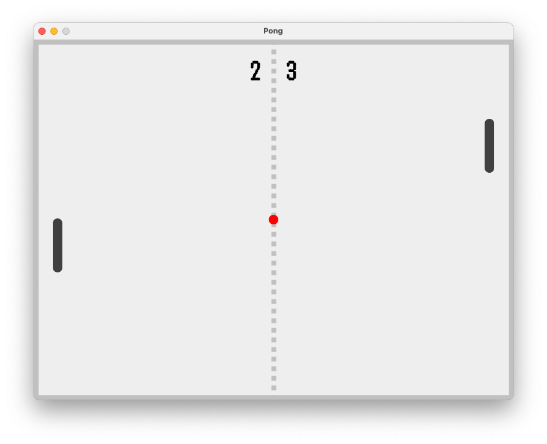

# Pong
The clone of the classic game "Pong" but cut off many things only remains basic functions.  

*This re-upload project is from Object-Oriented Programming class in 2021.*

## Keymap

### Player 1

- **W** - Move paddle up
- **S** - Move paddle down

### Player 2

- **Arrow up** - Move paddle up
- **Arrow down** - Move paddle down

### Etc.

- **Space** - Serve ball
- **Esc** - Pause while playing
